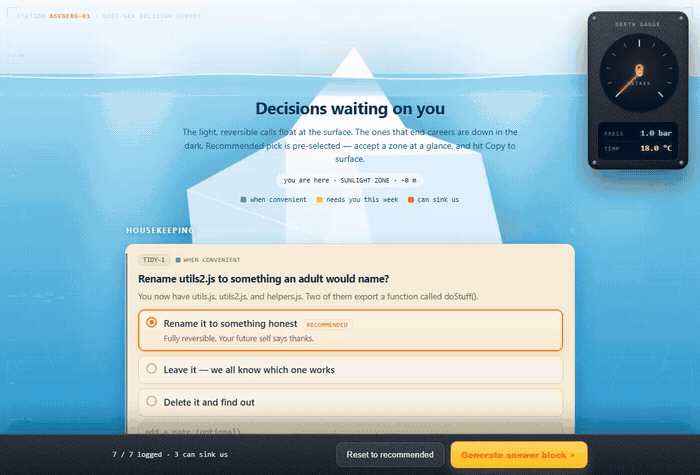

# 🧊 askberg

**Batch every decision waiting for you into one deep-sea survey. Answer the whole dive on your phone. Paste one block back. Surface.**

<p align="center">
  <!-- TODO: record docs/demo.gif — the dive from the sunlit surface down to the abyss, then the "surfacing" payoff -->
  
</p>

<p align="center">
  <em>The light, easy calls float at the surface. The ones that can sink the ship are down in the dark.</em>
</p>

---

## Why this exists (the boring-but-important part)

Coding agents love to ask permission. Wrap one in confirmations and you get a wall
of `approve?` prompts — which is *theatre*. Research on agent oversight found humans
catch the genuinely-bad action only **9–26%** of the time when it scrolls past in a
stream of look-alike prompts. People rubber-stamp.

The usual alternatives both lose:

- **Drip** — ask one-at-a-time → rubber-stamping.
- **Stall** — block until you're at the keyboard → the run does nothing.

**askberg is the third way.** The agent collects every real decision, keeps working
on the safe/reversible ones, and hands you *one* form with the recommended choice
pre-selected on each. You skim it on your phone, tap only what you disagree with,
and paste one plain-text block back. Nothing irreversible ever runs on a default.

And because the whole round-trip is **plain text**, it needs zero infrastructure —
no bot, no webhook, no server. It rides Telegram, a remote SSH session, or a paste
box. The gate is real for free: the run has no answers until you paste them, so the
missing data *is* the lock — not a "please ask me first" instruction the model can
talk itself past.

## What it looks like

It's a dive. A submarine depth gauge climbs as you scroll (−metres · pressure · temp,
bottoming out at Titanic's −3800 m, because of course it does). You pass through the
real ocean zones — sunlight, twilight, midnight, abyssal — reading decisions off cream
chart-paper survey cards, a crystalline iceberg looming behind them, a halftone whale
ghosting through the deep. Hit **Copy** and you surface: the berg calves with a splash,
the sky clears to sunset, a little boat settles into calm water. *Smooth sailing ahead.*

It's also a single self-contained HTML file with no dependencies, that works on a phone.

## How it works

askberg is two halves:

```
   DISCOVERY                         PRESENTATION
   scripts/discover.js               assets/build-form.js
   ─────────────────                 ────────────────────
   markers · docs · git · ledger  →  one self-contained  →  you answer,
   → candidates                      HTML form (the dive)     paste back → applied
        (the agent grades them into the questions schema)
```

1. **Discover** — `discover.js` scans the repo for decisions waiting on a human:
   inline markers, decision-shaped doc sections, git/PR state, and the agent's own
   ledger of forks it deferred mid-run.
2. **Grade** — the agent drops the non-gates, writes the recommended default for
   each, and clusters them by project (this half is judgement, not grep).
3. **Present** — `build-form.js` injects the graded questions into the frozen engine
   and writes one HTML form to an explicit project path.
4. **Answer & apply** — you open it anywhere, Copy, paste the block back; the agent
   applies each answer by ID and strikes the source so it's never re-asked.

## Quickstart

```bash
# 1. drop the skill in your Claude Code skills dir
git clone https://github.com/<you>/askberg ~/.claude/skills/askberg

# 2. find the decisions waiting in your repo
node ~/.claude/skills/askberg/scripts/discover.js        # → .askberg/candidates.json

# 3. (the agent grades those into questions.json, then:)
node ~/.claude/skills/askberg/assets/build-form.js questions.json .planning/decisions/decisions.html

# 4. open the file, answer on any device, hit Copy, paste the block back.
```

In Claude Code you just say **`/askberg`** (or *"what needs my decision?"*) and it
runs the whole loop. It also auto-offers the form when 4+ real gates pile up.

## The marker convention

Tag a decision anywhere in your code or docs and askberg will find it:

```js
// askberg: should this retry 3× or fail fast? affects the whole queue
// DECISION: postgres vs sqlite for the cache — @me
```

Markers are configurable and you can use several — see config. No markers? It still
works: the doc, git, and ledger collectors surface gates on day one; markers just
make it sharper.

## Decision schema & paste-back

Each decision is a small object — `id`, `cluster`, `urgency`, `question`, `context`,
and `options` with one `recommended`. The form emits a plain-text block on Copy that
the agent parses by `[ID]`; you can also just type shorthand (`all defaults`, or
`IC-1 a, REV-3 send, rest defaults`). Full schema + grammar in
[`SKILL.md`](SKILL.md) and [`assets/example.questions.json`](assets/example.questions.json).

## Config

Drop a `.askberg.yml` in your repo root to customise (all optional — see
[`.askberg.example.yml`](.askberg.example.yml)):

```yaml
markers: ["askberg:", "DECISION:", "@decision"]
docPaths: [".planning", "TODO.md", "docs/adr"]
outDir: ".planning/decisions"
cleanupDays: 14
```

## Security & privacy

askberg **only reads** your repo, and the form it produces is a **local HTML file
that makes zero network calls** — nothing is uploaded, indexed, or exfiltrated. Run
it on private repos without a second thought. The plain-text round-trip is the whole
point: no service ever sees your decisions.

## Cross-platform

The engine is dependency-free HTML, so it runs anywhere a browser does. The skill
wrapper targets Claude Code; adapters for Grok, Codex, and Gemini are generated with
[skilldrill](https://github.com/) *(coming with v1)*.

## Credits & inspiration

Built by **Sam Shennan** · [Veles Productions](https://velesproductions.com).

Art direction owes a debt to the deep-ocean image-makers and to Canadian Geographic's
["Wonder and loss: the deep ocean and its future"](https://canadiangeographic.ca/articles/wonder-and-loss-the-deep-ocean-and-its-future/)
— go look at the real thing; it's stranger and more beautiful than anything here.

## License

[MIT](LICENSE) — fork it, ship it, point it at your own repo.
